# Контрольная работа №3. Основы JavaScript

Предмет: Технологии создания программного обеспечения

ФИО: Фадеев Всеволод Вадимович

Группа: ЭФМО-02-25

Вариант: 17

Github: https://github.com/FFH255/mag-web-prac-3

## Задача 1. Панграмма

### Задача

Панграмма – это предложение, которое содержит каждую букву алфавита хотя бы один раз.

Например, «The quick brown fox jumps over the lazy dog» является панграммой, поскольку содержит хотя бы по 1 разу все символы от a до z (регистр не важен).

Напишите программу на JavaScript, которая проверяет, что введённая фраза является или не является панграммой. Выведите "yes", если является, и "no" в противном случае.

Фразу считывать без учёта регистра, выводить только строчными буквами.

**Формат ввода**

The five boxing wizards jump quickly

**Формат вывода**

yes

### Решение

*isPangram.ts*
```ts
type IsPangram = 'true' | 'false';

export function isPangram(input: string) : IsPangram {
    input = input.toLowerCase();

    const letters = new Set<string>();

    for (const char of input) {
        if (char >= 'a' && char <= 'z') {
            letters.add(char);
        }
    } 

    return letters.size === 26 ? 'true' : 'false';
}
```

*isPangram.test.ts*
```ts
import { isPangram } from './isPangram';

type TestCase = {
    input: string;
    want: string;
};

const testCases: TestCase[] = [
    { input: 'The quick brown fox jumps over the lazy dog', want: 'true' },
    { input: 'Sphinx of black quartz, judge my vow.', want: 'true' },
    { input: 'Pack my box with five dozen liquor jugs', want: 'true' },
    { input: 'Hello, World!', want: 'false' },
    { input: '', want: 'false' },
];

describe('isPangram', () => {
    testCases.forEach(({ input, want }) => {
        it(`"${input}" -> "${want}"`, () => {
            expect(isPangram(input)).toBe(want);
        });
    });
});
```

*cli.ts*
```ts
import * as readline from 'readline';
import { isPangram } from './isPangram';

const rl = readline.createInterface({
    input: process.stdin,
    output: process.stdout
});

rl.question('Введите фразу: ', (input: string) => {
    console.log(isPangram(input));
    rl.close();
});
```

### Результат работы

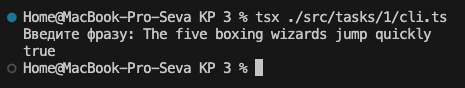

## Задача 2. Средний символ слова

### Задача

Дано слово длиной не более 50 символов и не короче 3 символов. Вывести на консоль средний символ слова.
- Если длина слова нечётная — вывести средний символ.
- Если длина слова чётная — вывести 2 средних символа.

Все слова на английском языке.

**Формат ввода**

bebra

**Формат вывода**

b

### Решение

*getMiddleCharacter.ts*
```ts
export function getMiddleCharacter(word: string): string {
  const middleIndex = Math.floor(word.length / 2);

  return word.length % 2 === 0 
    ? word.slice(middleIndex - 1, middleIndex + 1) 
    : word.charAt(middleIndex);                    
}
```

*getMiddleCharacter.test.ts*
```ts
import { getMiddleCharacter } from './getMiddleCharacter'

type TestCase = {
    input: string
    want: string
}

const testCases: TestCase[] = [
    { input: 'bebra', want: 'b' },
    { input: 'abcd', want: 'bc' },
]

describe('getMiddleCharacter', () => {
    testCases.forEach(({ input, want }) => {
        it(`"${input}" -> "${want}"`, () => {
            expect(getMiddleCharacter(input)).toBe(want)
        })
    })
})
```

### Результат работы

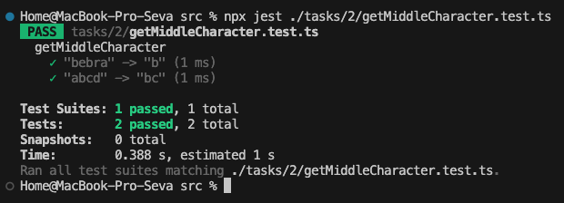

## Задача 3. CamelCase

### Задача

Верблюжий регистр (CamelCase) – это стиль написания составных слов, при котором несколько слов пишутся слитно без пробелов, при этом каждое слово  внутри фразы пишется с прописной буквы. 

Первая буква может быть строчной (например, camelCasing). 

В программе задана строка, написанная в верблюжьем регистре.

Напишите алгоритм, который разбивает эту строку пробелами.

Пример:

"camelCasing" => "camel Casing"

**Формат ввода**

SWAT

**Формат вывода**

S W A T

**Примечания**
- Подаётся строка из не более 50 символов.
- Вывести каждое слово составной строки через пробел.

### Решение

*splitCamelCase.ts*
```ts
export function splitCamelCase(text: string): string {
    return text
        .replace(/([a-z])([A-Z])/g, '$1 $2')
        .replace(/([A-Z])(?=[A-Z])/g, '$1 ');
}

type TestCase = {
    input: string
    want: string
}

function runTests(testCases: TestCase[]) {
    testCases.forEach((testCase, i) => {
        const got = splitCamelCase(testCase.input)
        console.log(
            `TEST CASE: ${i + 1}\n` +
            `input: ${testCase.input}\n` +
            `want: ${testCase.want}\n` +
            `got: ${got}\n` +
            `OK: ${got === testCase.want}\n`
        )
    })
}
```

*splitCamelCase.test.ts*
```ts
import { splitCamelCase } from './splitCamelCase'

type TestCase = {
    input: string
    want: string
}

const testCases: TestCase[] = [
    {
        input: 'camelCasing',
        want: 'camel Casing',
    },
    {
        input: 'SWAT',
        want: 'S W A T',
    },
    {
        input: 'simpleTestCase',
        want: 'simple Test Case',
    },
]

describe('splitCamelCase', () => {
    testCases.forEach(({ input, want }) => {
        it(`"${input}" -> "${want}"`, () => {
            expect(splitCamelCase(input)).toBe(want)
        })
    })
})
```

### Результат работы

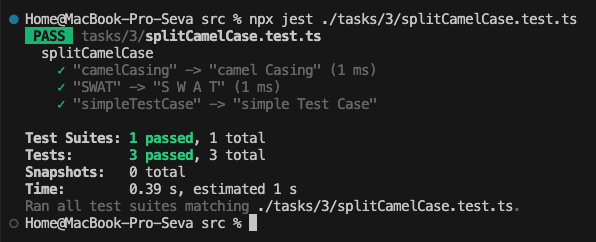

## Задача 4. Чётность числа

### Задача

Создайте функцию, которая принимает целое число в качестве аргумента и возвращает результат "Even" для чётных или "Odd"для нечётных чисел. 

Реализуйте программу с помощью стрелочных функций.

**Формат ввода**

7

**Формат вывода**

Odd

### Решение

*isEven.ts*
```ts
export const isEven = (num: number): string =>
    num % 2 === 0 ? 'Even' : 'Odd';
```

*isEven.test.ts*
```ts
import { isEven } from "./isEven"

type TestCase = {
    input: number
    want: string
}

const testCases: TestCase[] = [
    {
        input: 7,
        want: 'Odd',
    },
    {
        input: 10,
        want: 'Even',
    },
    {
        input: 0,
        want: 'Even',
    },
]

describe('isEven', () => {
    testCases.forEach(({ input, want }) => {
        it(`"${input}" -> "${want}"`, () => {
            expect(isEven(input)).toBe(want)
        })
    })
})
```

### Результат работы

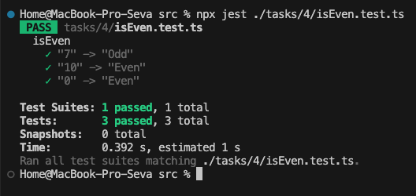

## Задача 5. В каком столетии год?

### Задача

Первое столетие охватывает от 1 года до 100 года включительно, второе столетие — от 101 года до 200 года включительно и т. д.

Для заданного года напишите функцию, возвращающую столетие, в котором этот год находится.

Например: 1705 → 18 столетие

**Формат ввода**

1706

**Формат вывода**

18

### Решение

*getCentury.ts*
```ts
export const getCentury = (year: number): number =>
    Math.ceil(year / 100);
```

*getCentury.test.ts*
```ts
import { getCentury } from "./getCentury"

type TestCase = {
    input: number
    want: number
}

const testCases: TestCase[] = [
    {
        input: 1706,
        want: 18,
    },
    {
        input: 1705,
        want: 18,
    },
    {
        input: 1900,
        want: 19,
    },
    {
        input: 2000,
        want: 20,
    },
    {
        input: 2001,
        want: 21,
    },
]

describe('getCentiry', () => {
    testCases.forEach(({ input, want }) => {
        it(`"${input}" -> "${want}"`, () => {
            expect(getCentury(input)).toBe(want)
        })
    })
})
```

### Результат работы

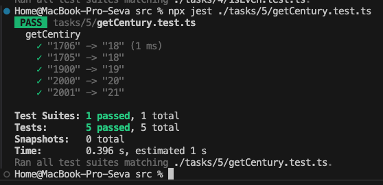

## Задача 6. Фильтрация массива

### Задача

Дан массив, который может содержать целые числа и строки.

На его основе получить массив, из которого все строки будут отфильтрованы (удалены, пропуски элементов не сохраняются).

Например: [1, 2, 'aasf', '1', '123', 123] → [1, 2, 123]

Каждый элемент исходного массива вводится через пробел.
- Число представляет собой набор цифр без других знаков и символов.
- Строки — любая другая последовательность.

Вывод каждого элемента осуществляется через пробел.

**Формат ввода**

23 ert 1 fg4ew 012 or 2

**Формат вывода**

23 1 2

**Примечания**
- Вводится последовательность элементов через пробел, в которой будет хотя бы одно число.
- Выводится последовательность чисел через пробел.

### Решение

*filterNumbers.ts*
```ts
export function filterNumbers(text: string): number[] {
    return [...new Set(text
        .split(' ')
        .filter(item => /^\d+$/.test(item))
        .map(Number))];
}
```

*filterNumbers.test.ts*
```ts
import { filterNumbers } from "./filterNumbers"

type TestCase = {
    input: string
    want: number[]
}

const testCases: TestCase[] = [
    {
        input: '23 ert 1 fg4ew 012 or 2',
        want: [23, 1, 12, 2],
    },
    {
        input: '1 2 aasf 123',
        want: [1, 2, 123],
    },
    {
        input: 'abc 007 x 42',
        want: [7, 42],
    },
]

describe('filterNumbers', () => {
    testCases.forEach(({ input, want }) => {
        it(`"${input}" -> "${want}"`, () => {
            expect(filterNumbers(input)).toEqual(want)
        })
    })
})
```

*cli.ts*
```ts
import * as readline from 'readline';
import { filterNumbers } from './filterNumbers';

const rl = readline.createInterface({
    input: process.stdin,
    output: process.stdout
});

rl.question('Введите массив, содержащий целые числа и строки, через пробел: ', (input: string) => {
    console.log(filterNumbers(input).join(' '));
    rl.close();
});
```

### Результат работы

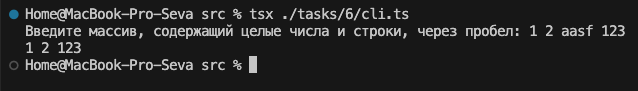

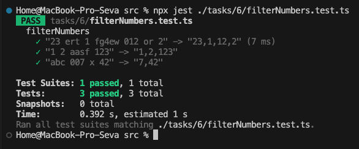

## Задача 7. Цифры числа в обратном порядке

### Задача

Стрелочная функция принимает случайное неотрицательное число.

Необходимо вернуть цифры этого числа в массиве в обратном порядке.

**Формат ввода**

69

**Формат вывода**

[9, 6]

**Примечания**
- Вводится число.
- Выводятся цифры в виде массива [a, b, c] или [c], если цифра одна.

### Решение

*reverseDigits.ts*
```ts
export const reverseDigits = (num: number): number[] =>
    String(num).split('').reverse().map(Number);
```

*reverseDigits.test.ts*
```ts
import { reverseDigits } from "./reverseDigits"

type TestCase = {
    input: number
    want: number[]
}

const testCases: TestCase[] = [
    {
        input: 69,
        want: [9, 6],
    },
    {
        input: 12345,
        want: [5, 4, 3, 2, 1],
    },
    {
        input: 0,
        want: [0],
    },
]

describe('reverseDigits', () => {
    testCases.forEach(({ input, want }) => {
        it(`"${input}" -> "${want}"`, () => {
            expect(reverseDigits(input)).toEqual(want)
        })
    })
})
```

### Результат работы

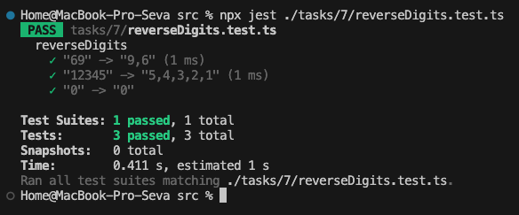

## Задача 8. Количество делителей числа

### Задача

Напишите стрелочную функцию, с помощью которой посчитайте количество делителей натурального числа n — аргумента функции.

**Формат ввода**

12

**Формат вывода**

6

### Решение

*countDivisors.ts*
```ts
export const countDivisors = (n: number): number => {
    let count = 0;

    for (let i = 1; i * i <= n; i++) {
        if (n % i === 0) {
            count += i * i === n ? 1 : 2;
        }
    }

    return count;
};
```

*countDivisors.test.ts*
```ts
import { countDivisors } from "./countDivisors"

type TestCase = {
    input: number
    want: number
}

const testCases: TestCase[] = [
    {
        input: 12,
        want: 6, // 1, 2, 3, 4, 6, 12
    },
    {
        input: 1,
        want: 1,
    },
    {
        input: 16,
        want: 5, // 1, 2, 4, 8, 16
    },
    {
        input: 25,
        want: 3, // 1, 5, 25
    },
]

describe('countDivisors', () => {
    testCases.forEach(({ input, want }) => {
        it(`"${input}" -> "${want}"`, () => {
            expect(countDivisors(input)).toEqual(want)
        })
    })
})
```

### Результат работы

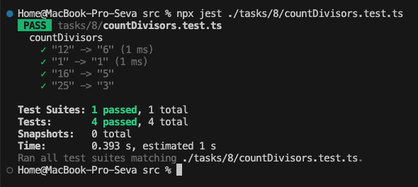

## Задача 9. Делители числа

### Задача

Создайте функцию с именем divisors, которая принимает целое число n > 1 и возвращает массив со всеми делителями числа (кроме 1 и самого числа), от наименьшего до наибольшего.

Если число простое, верните строку: (целое число) является простым

**Формат ввода**

16

**Формат вывода**

[2, 4, 8]

**Примечания**
- Делители выводятся в виде массива, то есть в формате [a, b, c] или [c],
если число одно.
- Для простых чисел (например, 13) выводится строка: 13 является простым

### Решение

*divisors.ts*
```ts
export const divisors = (n: number): number[] | string => {
    const result: number[] = [];

    for (let i = 2; i <= Math.floor(n / 2); i++) {
        if (n % i === 0) result.push(i);
    }

    return result.length ? result : `${n} является простым`;
};
```

*divisors.test.ts*
```ts
import { divisors } from "./divisors"

type TestCase = {
    input: number
    want: number[] | string
}

const testCases: TestCase[] = [
    {
        input: 16,
        want: [2, 4, 8],
    },
    {
        input: 13,
        want: '13 является простым',
    },
    {
        input: 12,
        want: [2, 3, 4, 6],
    },
    {
        input: 2,
        want: '2 является простым',
    },
]

describe('divisors', () => {
    testCases.forEach(({ input, want }) => {
        it(`"${input}" -> "${want}"`, () => {
            expect(divisors(input)).toEqual(want)
        })
    })
})
```

### Результат работы

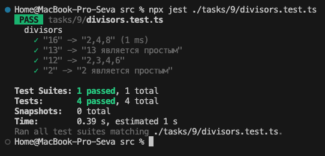

## Задача 10. Горный массив

### Задача

Массив `arr` называется горным, если выполняются следующие свойства:
1. В массиве не менее трёх элементов.
2. Существует единственный пик i (0 < i < arr.length – 1), такой что:
    - arr[0] < arr[1] < ... < arr[i - 1] < arr[i]
    - arr[i] > arr[i + 1] > ... > arr[arr.length - 1]

Реализовать две функции:
1. Первая функция проверяет, является ли массив arr горным с
помощью линейного поиска.
2. Если массив arr — горный, то с помощью алгоритма бинарного поиска вернуть индекс пика.

**Формат ввода**

1 5 4

**Формат вывода**

yes 1

**Примечания**
- Вводятся элементы массива через пробел.
- Вывести no, если массив не является горным.
- Вывести yes и через пробел индекс пика, если является горным.

### Решение

*checkMountain.ts*
```ts
// Проверка массива на "горный" с линейным проходом
const isMountainArray = (arr: number[]): boolean => {
    const n = arr.length;
    if (n < 3) return false;

    let i = 0;
    // Подъём
    while (i + 1 < n && arr[i] < arr[i + 1]) i++;
    
    // Пик не может быть первым или последним
    if (i === 0 || i === n - 1) return false;

    // Спуск
    while (i + 1 < n && arr[i] > arr[i + 1]) i++;

    return i === n - 1;
};

// Бинарный поиск пика
const findPeakIndex = (arr: number[]): number => {
    let left = 0, right = arr.length - 1;

    while (left < right) {
        const mid = Math.floor((left + right) / 2);
        if (arr[mid] < arr[mid + 1]) {
            left = mid + 1;
        } else {
            right = mid;
        }
    }

    return left;
};

// Главная функция
export const checkMountain = (arr: number[]): string => {
    if (!isMountainArray(arr)) return 'no';
    return `yes ${findPeakIndex(arr)}`;
};
```

*checkMountain.test.ts*
```ts
import { checkMountain } from "./checkMountain";

type TestCase = {
    input: number[]
    want: string
}

const testCases: TestCase[] = [
    { input: [1, 5, 4], want: 'yes 1' },
    { input: [1, 3, 2, 1], want: 'yes 1' },
    { input: [2, 1], want: 'no' },
    { input: [1, 2, 3], want: 'no' },
    { input: [3, 5, 5, 2], want: 'no' },
    { input: [0, 3, 2, 1], want: 'yes 1' },
];

describe('checkMountain', () => {
    testCases.forEach(({ input, want }) => {
        it(`"${input}" -> "${want}"`, () => {
            expect(checkMountain(input)).toEqual(want)
        })
    })
})
```

*cli.ts*
```ts
import * as readline from 'readline';
import { checkMountain } from './checkMountain';

const rl = readline.createInterface({
    input: process.stdin,
    output: process.stdout
});

rl.question('Введите массив: ', (input: string) => {
    console.log(checkMountain(input.split(' ').map(Number)));
    rl.close();
});
```

### Результат работы

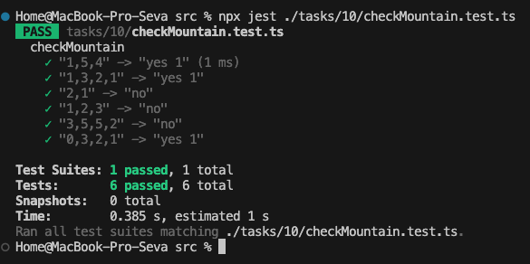

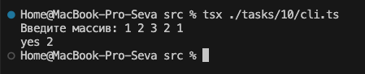

## Задача 11. Условные операторы и циклы

### Задача

Напишите программу, которая запрашивает строку и выводит true, если она начинается с буквы "a" или "A".

### Решение

*startsWithA.ts*
```ts
export const startsWithA = (text: string): boolean =>
    text.length > 0 && /^a/i.test(text);
```

*startsWithA.test.ts*
```ts
import { startsWithA } from "./startsWithA";

type TestCase = {
    input: string
    want: boolean
}

const testCases: TestCase[] = [
    { input: 'apple', want: true },
    { input: 'Apple', want: true },
    { input: 'banana', want: false },
    { input: 'Apricot', want: true },
    { input: '', want: false },
];

describe('startsWithA', () => {
    testCases.forEach(({ input, want }) => {
        it(`"${input}" -> "${want}"`, () => {
            expect(startsWithA(input)).toEqual(want)
        })
    })
})
```

*cli.ts*
```ts
import * as readline from 'readline';
import { startsWithA } from './startsWithA';

const rl = readline.createInterface({
    input: process.stdin,
    output: process.stdout
});

rl.question('Введите строку: ', (input: string) => {
    console.log(startsWithA(input));
    rl.close();
});
```

### Результат работы

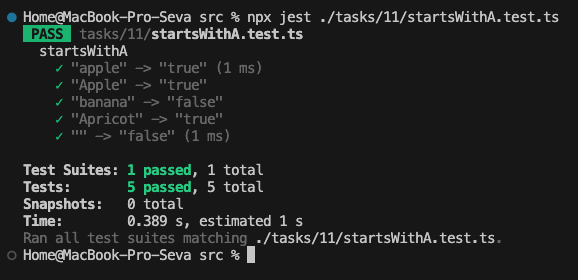

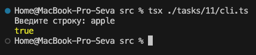

## Задача 12. Функции

### Задача

Напишите функцию, которая принимает два числа и возвращает их наибольший общий делитель (НОД).

### Решение

*gcd.ts*
```ts
export const gcd = (a: number, b: number): number => {
    while (b !== 0) {
        [a, b] = [b, a % b];
    }
    return a;
};
```

*gcd.test.ts*
```ts
import { gcd } from "./gcd";

type TestCase = {
    input: [number, number]
    want: number
}

const testCases: TestCase[] = [
    { input: [12, 18], want: 6 },
    { input: [101, 103], want: 1 },
    { input: [48, 18], want: 6 },
    { input: [7, 21], want: 7 },
];

describe('gcd', () => {
    testCases.forEach(({ input, want }) => {
        it(`"${input}" -> "${want}"`, () => {
            expect(gcd(input[0], input[1])).toEqual(want)
        })
    })
})
```

### Результат работы

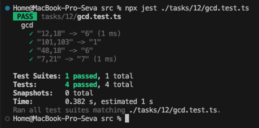

## Задача 13. Массивы

### Задача

Напишите программу, которая запрашивает у пользователя размер массива и заполняет его числами. Затем находит количество элементов, которые кратны заданному числу.

### Решение

*countMultiples.ts*
```ts
export function countMultiples(arr: number[], divisor: number): number {
    return arr.filter(n => n % divisor === 0).length;
}
```

*countMultiples.test.ts*
```ts
import { countMultiples } from "./countMultiples";

type TestCase = {
    input: [number[], number]; // [массив, делитель]
    want: number;
}

const testCases: TestCase[] = [
    { input: [[2, 5, 10, 7, 15], 5], want: 3 },
    { input: [[1, 2, 3, 4], 5], want: 0 },
    { input: [[], 3], want: 0 },
    { input: [[-6, -3, 0, 3, 6], 3], want: 5 },
    { input: [[1, 2, 3, 4, 5, 6, 7, 8, 9, 10], 2], want: 5 },
];

describe('countMultiples', () => {
    testCases.forEach(({ input, want }) => {
        it(`countMultiples(${JSON.stringify(input[0])}, ${input[1]}) -> ${want}`, () => {
            expect(countMultiples(input[0], input[1])).toEqual(want);
        });
    });
});

```

*cli.ts*
```ts
import * as readline from 'readline';
import { countMultiples } from "./countMultiples";

const rl = readline.createInterface({
    input: process.stdin,
    output: process.stdout
});

function askNumber(question: string): Promise<number> {
    return new Promise((resolve) => {
        rl.question(question, (answer) => {
            resolve(Number(answer));
        });
    });
}

async function main() {
    const size = await askNumber('Введите размер массива: ');
    const arr: number[] = [];

    for (let i = 0; i < size; i++) {
        const num = await askNumber(`Введите элемент ${i + 1}: `);
        arr.push(num);
    }

    const divisor = await askNumber('Введите число для проверки кратности: ');
    const count = countMultiples(arr, divisor);

    console.log(`Количество элементов, кратных ${divisor}: ${count}`);
    rl.close();
}

main();
```

### Результат работы


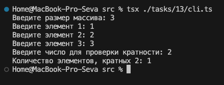

## Задача 14. Все темы

### Задача

Напишите функцию, которая принимает число и возвращает его квадрат, если оно в диапазоне от -5 до 5.

### Решение

*squareIfInRange.ts*
```ts
export function squareIfInRange(n: number): number | null {
    if (n >= -5 && n <= 5) {
        return n * n;
    }
    return null; // возвращаем null, если число вне диапазона
}

```

*squareIfInRange.test.ts*
```ts
import { squareIfInRange } from "./squareIfInRange";

type TestCase = {
    input: number;
    want: number | null;
}

const testCases: TestCase[] = [
    { input: 3, want: 9 },
    { input: -4, want: 16 },
    { input: 5, want: 25 },
    { input: -5, want: 25 },
    { input: 6, want: null },
    { input: -10, want: null },
    { input: 0, want: 0 },
];

describe('squareIfInRange', () => {
    testCases.forEach(({ input, want }) => {
        it(`squareIfInRange(${input}) -> ${want}`, () => {
            expect(squareIfInRange(input)).toEqual(want);
        });
    });
});

```

### Результат работы

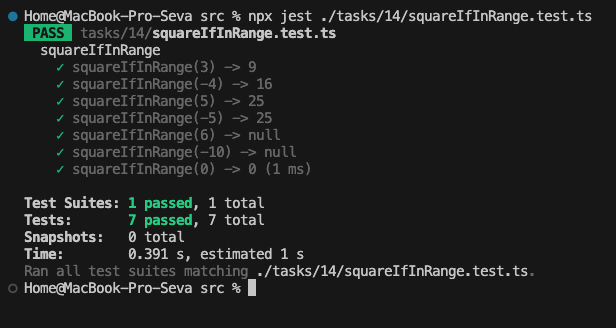